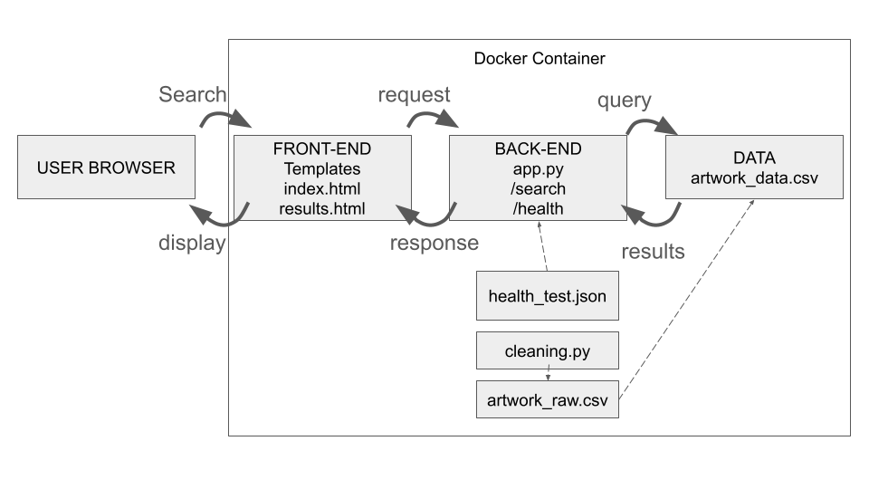

# corgis-tateCollection
## Executive Summary
**Problem:** Museums across the globe keep large collections of very significant objects. When these collections take inventory or change, it is a significant event, especially for Tate. The Tate "family" is a large collection of art galleries in the UK. If the records are not clear, it is difficult to quickly find what pieces of the collection are still in the museum's posession. Furthermore, the museum must identify them with more than one piece of information. We must create something for the Tate Museum curators to quickly search through their inventory (and for potential museum visitors looking for a specific piece or potential partner museums looking to exchange). 

**Solution:** Build a simple search tool app where users search by typing in the title of the piece, or the name of the artist, or the year an art piece was created. The search tool will immediately display the matching artwork. Behind the scenes, the app cleans through the dataset of the museum collection.

## System Overview
**Course Concept(s):** Initially a single interactive Bash script that including piping and was committed to a GitHub repo (inspired by Case03). Transitioned in to the final product: Flask app, J-SON endpoints, data ingestion and cleaning, and containerization with Docker (inspired by Case04).

**Architecture Diagram:** 



**Data/Modules/Services:** Flask, JSON, Tate Museum artwork_data.csv (free-for-use)from the Tate Museum GitHub (link at bottom of page)

## How to Run (Local)
```
# build
docker build -t flask-art-search-app .
# run
docker run -p 5000:5000 flask-art-search-app
```

## Design Decisions
**Why this concept?** Initially, the solution was in the form of a single Bash script. However, this approach felt quite 2D. The user had a harder time interacting with the search function and it was slower. The Flask app is faster, more flexible, and more interactive. The current concept allows for more informative results by connecting with the dataset in more than one way. 

**Tradeoffs:** This dataset of artwork is large and because the flask app must search it all, that means it stores a lot of memory and could slow down as the dataset increases. Other structures could be a smarter choice because they deal with the memory better. Other structures would be more complex and able to do more, but they would require more structure and possibly paying more. Currently, the flask app is free and flexible, but simple. 

**Security/Privacy:** N/A. There are no secrets.

**Ops:** Similarly to considered tradeoffs, there may be storage and speed limitations due to the large amount of memory. For instance, the Tate Github that is used is no longer actively maintained. Therefore, the data is actually not changing so storage of the cleaned dataset is not a problem for the flask app, but if for reason the dataset changed id change or the more comprehensive data set was used, the app would be heavily limited and difficult to scale.

## Results & Evaluation
A screenshot of sample outputs is within the assets folder. The search is very fast and easy to navigate. Images appear, and if there are many results, then they simply appear a little slower.
For validation/ tests, health check was succseful (found in 'tests' folder) and searching up the artist 'Monet' was also succesful (see screenshot in the 'assets' folder) alongside other searches by title, and year. 

## What’s Next
The next planned improvement would likely be adding more than one search field to make searches even more specific. Additionally, a strong addition would be a feature in the search bar that acts like predictive typing (auto-complete), so when a user begins typing, it provides them with possible options of what they might want to look up. That could include blob storage. This way, it is not compeltely human-memory reliant. More features would make this into a more complete website that could stretch wider. 

## Links
## Github Repo: [Link](https://github.com/kellykohout/corgis-tateCollection/tree/main)
## Tate Github: [Link](https://github.com/tategallery/collection)
## Public cloud App: Optional - n/a